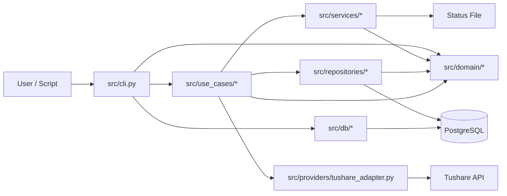
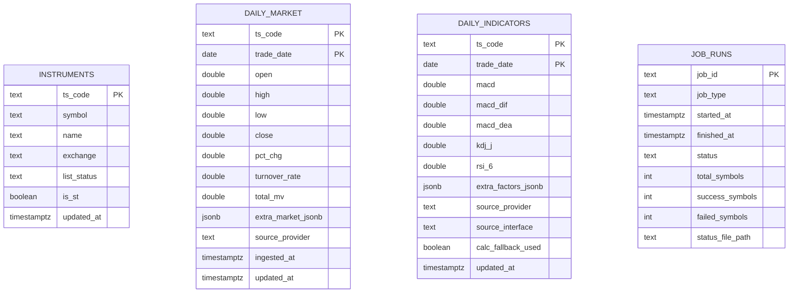
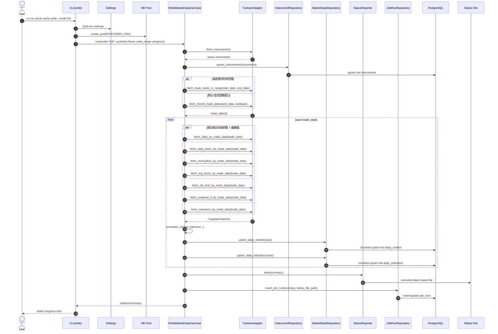
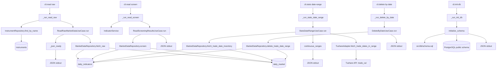

# Stock Cache 架构文档

本文档基于当前仓库实现整理，描述 `stock-cache` CLI 的分层结构、核心职责、主链路时序，以及函数到资源级别的数据流。

## 1. 项目定位

`stock-cache` 是一个基于 Typer 的 Python CLI，用于：

- 从 Tushare 拉取 A 股行情与指标数据
- 将标准化后的结果写入 PostgreSQL
- 记录写入任务状态与最近一次写入结果
- 以 JSON 形式读取缓存数据，供脚本或人工检查使用

支持的主入口：

- `uv run stock-cache ...`
- `uv run python -m cli ...`

## 2. 分层架构

代码按明确分层组织：

- `src/cli.py`
  - Typer 命令入口
  - 参数校验
  - 依赖装配
  - JSON 输出与错误退出
- `src/use_cases/`
  - 业务编排层
  - 串联 provider、repository、service
- `src/services/`
  - 标准化、重试、状态文件、指标补位等横切逻辑
- `src/repositories/`
  - PostgreSQL 读写封装
- `src/providers/`
  - 上游市场数据适配器，目前为 `TushareAdapter`
- `src/db/`
  - 连接池与 schema 初始化
- `src/domain/`
  - 领域模型与错误定义

### 2.1 总体组件图



## 3. 核心模块职责

### 3.1 CLI 层

`src/cli.py` 暴露 5 组命令：

- `init-db`
- `write`
- `read raw`
- `read screen`
- `stats date-range`
- `delete by-date`

CLI 层只做四件事：

- 解析命令参数
- 校验输入组合是否合法
- 构建 `Settings`、连接池、仓储、provider、use case
- 将结果输出为 JSON，或以统一 JSON 错误格式退出

### 3.2 Use Case 层

当前用例的职责如下：

- `WriteMarketDataUseCase`
  - 写入主流程编排
  - 决定目标股票集合与交易日集合
  - 调用 provider 抓取多种行情批次
  - 调用 normalizer 合并为统一行模型
  - 调用 repository 分批 upsert
  - 记录状态文件和 `job_runs`
- `ReadRawMarketDataUseCase`
  - 读取 `daily_market` + `daily_indicators`
  - 转成 JSON 友好结构
- `ReadScreeningResultsUseCase`
  - 基于缓存表做条件筛选
- `StatsDateRangeUseCase`
  - 统计缓存数据的实际连续交易日区间
- `DeleteByDateUseCase`
  - 删除指定交易日或区间的数据

### 3.3 Service 层

- `normalizer.py`
  - 合并 `daily`、`daily_basic`、`moneyflow`、`adj_factor`、`stk_limit`、`suspend_d`、`stk_factor*`
  - 产出 `DailyMarketRow[]` 和 `DailyIndicatorRow[]`
- `retry.py`
  - 对可重试 provider 异常做指数退避
- `status_reporter.py`
  - 将最近一次写入任务摘要写入固定路径文本文件
- `indicators.py`
  - 当前提供指标补位接口与本地 MACD fallback 计算函数
  - 但 `read screen` 当前尚未真正触发在线/本地补位流程

### 3.4 Repository 层

- `InstrumentRepository`
  - `instruments` 表 upsert
  - 按名称解析 `ts_code`
- `MarketDataRepository`
  - `daily_market`、`daily_indicators` upsert
  - 原始读取
  - 条件筛选
  - 交易日库存统计
  - 按日期删除
- `JobRunRepository`
  - 将写入任务摘要持久化到 `job_runs`

### 3.5 Provider 层

`TushareAdapter` 封装以下上游能力：

- 股票基础列表
- 最近交易日
- 交易日区间
- 单股票维度拉取
- 单交易日维度批量拉取

它通过线程 + 超时队列包装同步 Tushare 调用，并把网络类异常转为可重试错误。

## 4. 数据资源

### 4.1 外部资源

- Tushare API
- PostgreSQL
- 本地状态文件 `STATUS_FILE_PATH`
- 环境配置 `.env`

### 4.2 数据表



说明：

- `daily_market` 保存价格、成交、估值、资金流及额外行情字段
- `daily_indicators` 保存技术指标及额外因子字段
- `job_runs` 保存任务摘要计数，不保存完整成功/失败明细
- 最近一次任务的完整明细写入状态文件，而不是数据库

## 5. 核心功能时序图

项目的中心功能是 `write`。其中 `--mode full` 是最能体现系统架构的主链路。

### 5.1 全量写入时序图



关键特征：

- `full` 模式按交易日逐日处理，不一次性积压整个时间窗的数据
- 每个交易日内部并发拉取 7 类数据
- 标准化后按批次写库，批次大小由 `WRITE_BATCH_SIZE` 控制
- 写入结果同时落地到数据库摘要表和本地状态文件

## 6. 函数资源级流程图

下面的图更关注“函数调用到了哪些资源”。

### 6.1 写入链路

```mermaid
flowchart TD
    A[cli.write] --> B[_validate_write_selector]
    A --> C[_validate_write_range]
    A --> D[_run_write]

    D --> E[Settings()]
    D --> F[create_pool]
    D --> G[WriteMarketDataUseCase.run]

    G --> H{symbols 是否已指定}
    H -- 否 --> I[TushareAdapter.fetch_instruments]
    I --> R1[Tushare API: stock_basic]
    I --> J[InstrumentRepository.upsert_instruments]
    J --> R2[(instruments)]

    H -- 是 --> K[直接使用 ts_code<br/>或按名称解析]
    K --> L[InstrumentRepository.find_by_name]
    L --> R2

    G --> M[_trade_dates]
    M --> N[TushareAdapter.fetch_recent_trade_dates]
    M --> O[TushareAdapter.fetch_trade_dates_in_range]
    N --> R3[Tushare API: trade_cal]
    O --> R3

    G --> P[with_retries]
    P --> Q[_fetch_trade_date_payload]
    Q --> R4[Tushare API: daily]
    Q --> R5[Tushare API: daily_basic]
    Q --> R6[Tushare API: moneyflow]
    Q --> R7[Tushare API: adj_factor]
    Q --> R8[Tushare API: stk_limit]
    Q --> R9[Tushare API: suspend_d]
    Q --> R10[Tushare API: stk_factor_pro / stk_factor]

    Q --> S1[normalize_market_batches]
    S1 --> T1[DailyMarketRow[]]
    S1 --> T2[DailyIndicatorRow[]]

    T1 --> U1[MarketDataRepository.upsert_daily_market]
    T2 --> U2[MarketDataRepository.upsert_daily_indicators]
    U1 --> R11[(daily_market)]
    U2 --> R12[(daily_indicators)]

    G --> V[StatusReporter.write]
    V --> R13[STATUS_FILE_PATH]
    G --> W[JobRunRepository.insert_job_run]
    W --> R14[(job_runs)]
```

### 6.2 读取与维护链路



## 7. 命令到模块映射

| 命令 | 入口函数 | 用例 | 主要资源 |
| --- | --- | --- | --- |
| `init-db` | `init_db` | `initialize_schema` | `schema.sql`、PostgreSQL |
| `write` | `write` | `WriteMarketDataUseCase` | Tushare、`instruments`、`daily_market`、`daily_indicators`、`job_runs`、状态文件 |
| `read raw` | `read_raw` | `ReadRawMarketDataUseCase` | `instruments`、`daily_market`、`daily_indicators` |
| `read screen` | `read_screen` | `ReadScreeningResultsUseCase` | `daily_market`、`daily_indicators` |
| `stats date-range` | `stats_date_range` | `StatsDateRangeUseCase` | `daily_market`、`daily_indicators`、Tushare `trade_cal` |
| `delete by-date` | `delete_by_date` | `DeleteByDateUseCase` | `daily_market`、`daily_indicators` |

## 8. 当前架构特征与边界

### 8.1 优点

- CLI 很薄，依赖装配和业务编排分离清晰
- 写入链路按交易日处理，内存占用受控
- Repository 层集中管理 SQL 和表结构耦合点
- 输出契约稳定，读命令统一返回 JSON
- Provider 超时和重试策略清晰独立

### 8.2 当前边界

- 当前只有一个 provider，实现上强依赖 Tushare 字段形态
- `IndicatorService.ensure_indicators()` 仍是预留接口，读取筛选尚未触发真实补位
- `job_runs` 只保留统计摘要，完整错误明细依赖状态文件
- `app_logging.py` 已存在，但 CLI 主路径当前没有显式接入日志初始化

## 9. 建议的阅读顺序

如果要继续维护此项目，推荐按下面顺序进入代码：

1. `src/cli.py`
2. `src/use_cases/write_market_data.py`
3. `src/repositories/market_data.py`
4. `src/services/normalizer.py`
5. `src/providers/tushare_adapter.py`
6. `src/db/schema.sql`

这样能最快建立“命令入口 -> 业务编排 -> 数据资源”的完整心智模型。
